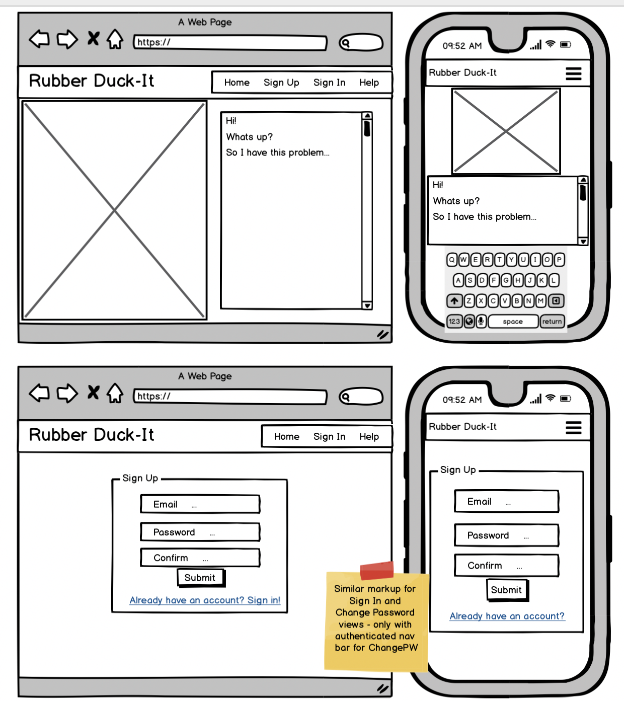
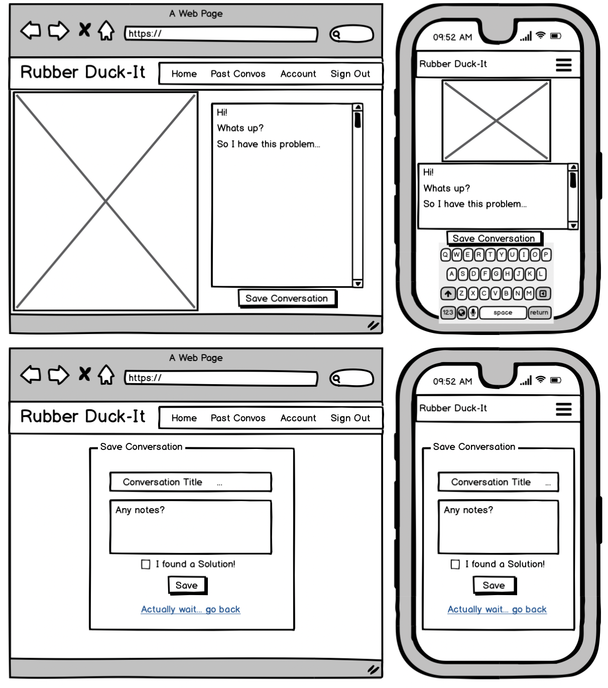
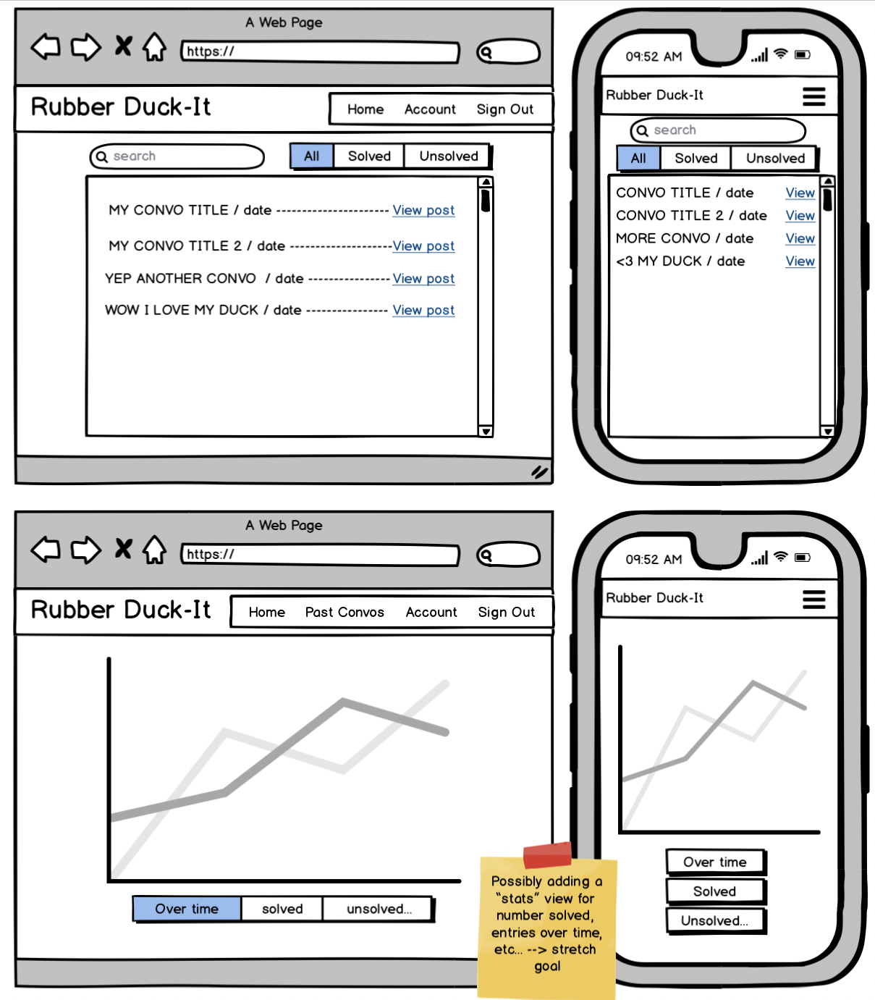

# RubberDuck It: Client Side
A front end application for the RubberDuck It Project.

## Dependencies (Set up & Installation)
* [GA React Auth Template](https://git.generalassemb.ly/ga-wdi-boston/react-auth-template) includes linters, SCSS compiler, Webpack config, NPM scripts, authentication components/routes,
* `git init`, `git add`, `git commit`
* `npm install` installs dependencies
* `npm run make-standard` reformats all your code in the JavaScript Standard Style.
* `npm run build` puts bundled styles/scripts where `index.html` can find them
* `npm run nag` code quality analysis
* `npm run start` run the development server
* `npm run deploy` on master branch w/clean directory

## Structure
* `App` renders the `Header` component & the routes, each of which render a component from `src/components`.
* `src/api/auth.js` contains all the needed `axios` calls pertaining to authentication.
* To apply component specific styles, add a file to the component's directory such as `ComponentName.scss` and then import it directly into the component with `import './ComponentName.scss'`.  This will keep your styles modularized and make it easier to make changes at the component level.

## User Stories
- As a user I want to be able to have a text conversation with the RubberDuck chatbot
- As an unregistered user I want to be able to sign up/create an account
- As a registered user I want to be able to sign in
- As a signed-in user I want to be able to...
  - update my account information & sign out
  - save my RubberDuck conversation
  - view all of my saved conversations
  - view a specific saved conversation
  - change the title of a conversation
  - *Stretceh*? Pick up on a saved conversation
  - delete a saved conversation

## Project Structure
#### MVP:
* Provide sign up/in/out & change password functionality
* Present a useable chatbot with a rubber duck image
* CRUD on a 'conversation' resource for authenticated users

#### Moderate Stretch Goals:
* Offer search bar & solved/unsolved/all nav bar
* Offer a "return to convo" link on the save (POST) page
* Offer a "stats" view where users can access various data visualizations on their entries

#### Stretch "For the Stars!" Goals:
* Offer google/facebook authentication
* Offer "forgot password" option for un-signed in users

## Wireframes

## Problem Solving
...

## Unsolved Problems
...
